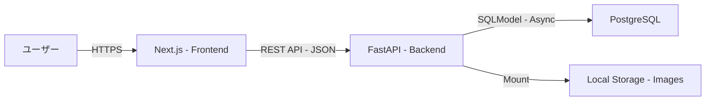
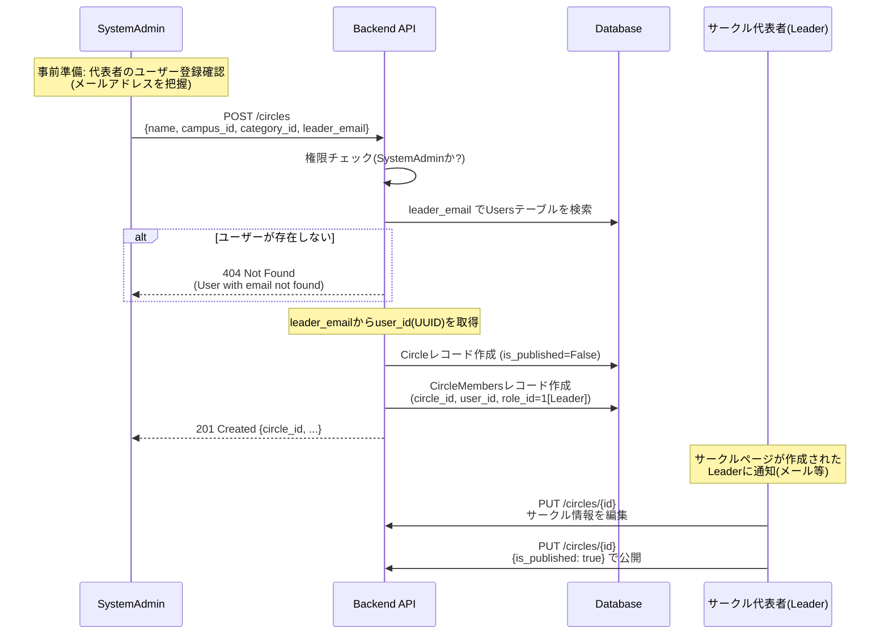
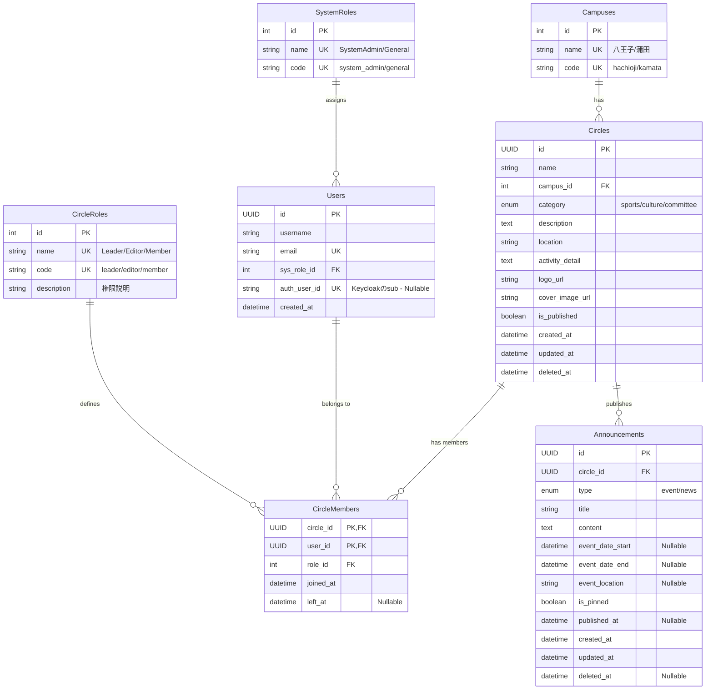
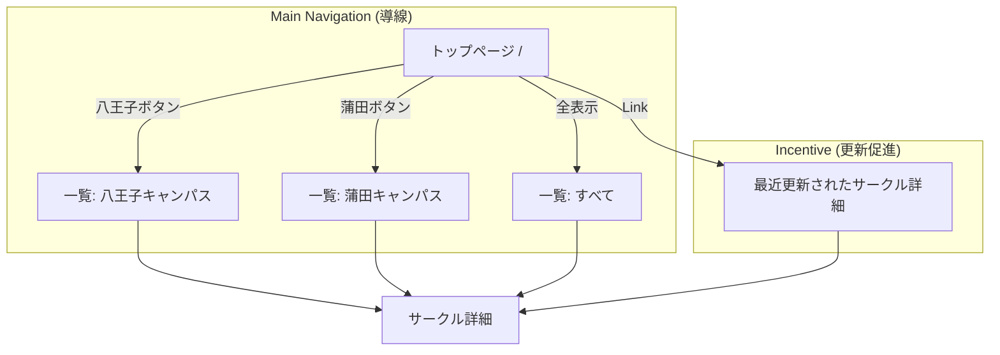

# CirclePortal 要件定義書 & DB設計書

2025-12-05 17:34

## 1. プロジェクト概要

### 1.1. サービス目的

大学のサークル（クラブ・部活・同好会）情報を集約し、学生および学外（受験生等）へ可視化するWebサービス。
情報の鮮度を保つため、**「各サークルの担当者が自律的に情報を更新できる」** ことを最大の強みとする。

### 1.2. ターゲットユーザー

1.  **閲覧者 (Guest):** 受験生、在学生。サークルを探している人。
2.  **サークル管理者 (Circle Admin):** 各サークルの代表・広報担当。情報の更新を行う。
3.  **システム管理者 (System Admin):** 学務課、およびLinuxClub等の運用担当。サークルの承認・停止、全体のお知らせ管理を行う。

-----

## 2. システムアーキテクチャ・技術選定

初心者（学部1\~2年生）でもメンテナンスが可能であり、かつモダンな学習効果の高い構成を採用する。

### 2.1. 技術スタック

| カテゴリ | 技術選定 | 選定理由 |
| :--- | :--- | :--- |
| **Frontend** | **Next.js (App Router)** | 動的なOGP生成、モダンなUI構築のため。表示ロジックに専念する。(バックエンド的な処理・ロジックは組まない) |
| **Backend** | **Python (FastAPI)** | CS学部必修言語(Python)の活用。型安全性とSwagger UIによるAPI定義の明確化。 |
| **Database** | **PostgreSQL** | 堅牢なRDBMS。配列型やJSON型など高度な機能も利用可能。 |
| **ORM** | **SQLModel** | SQLAlchemy + Pydantic。DB定義とAPI型定義を一元管理し、二重管理を防ぐ。 |
| **Infra** | **Docker Compose** | (初期) オンプレサーバでの簡易運用。(将来的にk8sへ移行の可能性有)|
| **UI Lib** | **shadcn/ui + Tailwind** | デザイン担当不在でも、高品質かつ統一感のあるUIを(できるだけ)迅速に構築するため。 |

### 2.2. システム構成図 (概念)



-----

## 3. 機能要件

### 3.1. 認証・認可方針

  * **フェーズ1 (開発初期):** 認証機能はモック、または簡易実装とする。
  * **フェーズ2 (本番運用):** **Keycloak** を導入する。
      * **学内制限:** `@edu.teu.ac.jp` ドメインのみ登録許可（Keycloak側で制御したい）。
          * 管理者アカウントの追加(サービス管理者はedu以外もOK)
      * **権限管理:** ハイブリッド構成を採用。
          * システム管理者権限 $\rightarrow$ KeycloakのRoleで管理。
          * サークル編集権限 $\rightarrow$ アプリDB (`User` - `Circle` 紐付け) で管理。

### 3.2. 主要機能リスト

| 機能 | 概要 | 備考 |
| :--- | :--- | :--- |
| **サークル一覧・検索** | キャンパス別(八王子/蒲田)、カテゴリ別 | フリーワード検索対応 |
| **サークル詳細表示** | 活動内容、活動場所、SNSリンク、新歓情報の表示 | **動的OGP**を生成しSNSシェアに対応 |
| **サークル編集** | サークル管理者が自団体の情報を更新 | 画像アップロード含む |
| **お知らせ管理** | 新歓、合宿、学祭等のお知らせ情報登録 | イベント開催情報を含む |
| **管理者機能** | サークルアカウントの発行・承認、論理削除されたデータの復旧等 | |

### 3.3. API設計方針

**Strict REST** に基づき設計する。

一部設計: 
| メソッド | エンドポイント | 実行権限 | 概要・挙動 |
| :--- | :--- | :--- | :--- |
| `GET` | **/circles** | **誰でも** | サークル一覧を取得する。<br>※学外ユーザーには公開用フィールドのみ返す。 |
| `POST` | **/circles** | **SystemAdmin** | 新規サークルを作成する。<br>※リクエストボディには`name`, `campus_id`, `category_id`, `leader_email`を必須とする。<br>※バックエンドは`leader_email`からユーザーUUIDを解決し、Leaderとして登録する。<br>※初期状態は非公開(`is_published=False`)、空白のサークルページが作成される。 |
| `GET` | **/circles/{id}** | **誰でも** | サークル詳細情報を取得する。<br>※学外ユーザーには公開用フィールドのみ返す。 |
| `PUT` | **/circles/{id}** | **代表者・幹部 / SystemAdmin** | サークル情報を更新する。<br>※代表者・幹部は「自分のサークル」のみ操作可能。 |
| `DELETE` | **/circles/{id}** | **代表者 / SystemAdmin** | サークルを削除する(論理削除)。<br>※代表者またはSystemAdminのみ実行可能。 |

※ `Announcement` や `User` 関連のエンドポイントも同様のポリシー（更新は権限者のみ）で実装する。

### 3.4. サークル作成フロー (詳細)

サークルの新規作成は**SystemAdminのみ**が実行できる。一般ユーザーによる自由なサークル作成は認めない。

#### 3.4.1. フロー概要



#### 3.4.2. 処理の詳細ステップ

1. **事前準備 (SystemAdmin)**
   - サークル代表者となるユーザーが既にシステムに登録されていることを確認する
   - **代表者のメールアドレスを把握する** (例: `taro.yamada@edu.teu.ac.jp`)
   - もし未登録の場合、先に代表者のユーザーアカウントを作成する (または代表者自身にサインアップしてもらう)

2. **サークル作成リクエスト (SystemAdmin → Backend)**
   - `POST /circles` を実行
   - リクエストボディ:
     ```json
     {
       "name": "LinuxClub",
       "campus_id": 1,
       "category_id": 2,
       "leader_email": "taro.yamada@edu.teu.ac.jp"
     }
     ```

3. **バックエンド処理 (Atomic Transaction)**
   - ① 実行ユーザーが`SystemAdmin`であることを確認 (sys_role_id=1)
   - ② **`leader_email`でUsersテーブルを検索し、対応するユーザーID(UUID)を取得**
     - SQL例: `SELECT id FROM users WHERE email = 'taro.yamada@edu.teu.ac.jp' AND deleted_at IS NULL`
     - ユーザーが見つからない場合は `404 Not Found` を返す
   - ③ `Circles`テーブルに新規レコードを挿入
     - `is_published` = `False` (初期状態は非公開)
     - その他のフィールド(`description`, `location`等)は空白またはNULL
   - ④ `CircleMembers`テーブルに新規レコードを挿入
     - `circle_id` = 新規作成されたサークルのID
     - `user_id` = ②で取得したUUID
     - `role_id` = `1` (Leader)
   - ⑤ トランザクションをコミット

4. **通知 (オプション・将来実装)**
   - 代表者にメールやシステム通知で「サークルページが作成されました」と伝える

5. **サークル情報の編集 (Leader)**
   - 代表者は`PUT /circles/{id}`を使って、サークルの詳細情報を編集する
   - `description`, `location`, `activity_detail`, `logo_url`等を追加

6. **公開 (Leader)**
   - 情報が整ったら、`is_published`を`true`に更新して一般公開する

#### 3.4.3. エラーハンドリング

| エラーケース | HTTPステータス | レスポンス例 |
| :--- | :--- | :--- |
| 実行ユーザーがSystemAdminでない | `403 Forbidden` | `{"detail": "Only SystemAdmin can create circles"}` |
| `leader_email`に対応するユーザーが存在しない | `404 Not Found` | `{"detail": "User with email 'xxx@edu.teu.ac.jp' not found"}` |
| `campus_id`または`category_id`が無効 | `400 Bad Request` | `{"detail": "Invalid campus_id or category_id"}` |
| 必須フィールドが欠けている | `422 Unprocessable Entity` | FastAPIのバリデーションエラー |
| `leader_email`が無効なメール形式 | `422 Unprocessable Entity` | `{"detail": "Invalid email format"}` |

-----

## 4. データベース設計 (Schema)

ORMに **SQLModel** を使用する。以下は論理モデルである。

### 4.1. マスタテーブルとEnum

参照データは以下の方針で管理する：
- **マスタテーブル**: 運用中に値の追加・変更があり得るデータ (Campuses, SystemRoles, CircleRoles)
- **Enum**: システム定義で固定的な値 (CircleCategory, AnnouncementType)

#### 4.1.1. Campuses (キャンパスマスタ)

  * `id`: Integer (PK, Auto Increment)
  * `name`: String (Unique) - 例: `八王子`, `蒲田`
  * `code`: String (Unique) - 例: `hachioji`, `kamata`

#### 4.1.2. CircleCategory (Enum)

サークルカテゴリを表す固定値。変更が想定されないためEnumで管理。

  * `sports`: 運動系
  * `culture`: 文化系
  * `committee`: 委員会

#### 4.1.3. SystemRoles (システム権限マスタ)

  * `id`: Integer (PK, Auto Increment)
  * `name`: String (Unique) - 例: `SystemAdmin`, `General`
  * `code`: String (Unique) - 例: `system_admin`, `general`

#### 4.1.4. CircleRoles (サークル内権限マスタ)

  * `id`: Integer (PK, Auto Increment)
  * `name`: String (Unique) - 例: `Leader`, `Editor`, `Member`
  * `code`: String (Unique) - 例: `leader`, `editor`, `member`
  * `description`: String - 権限の説明
      * `Leader`: サークル代表(全権限)
      * `Editor`: 幹部(編集権限あり)
      * `Member`: 平部員(閲覧のみ)

#### 4.1.5. AnnouncementType (Enum)

お知らせ種別を表す固定値。変更が想定されないためEnumで管理。

  * `event`: イベント - イベント開催のお知らせ(新歓、合宿、学祭等)
  * `news`: ニュース - 一般的なお知らせ(活動報告、大会結果等)

### 4.2. Users (ユーザー)

サークル個別の役割とは別に、システム全体における権限を管理するカラムがある。

  * `id`: UUID (PK)
  * `username`: String
  * `email`: String (Unique)
  * `sys_role_id`: Integer (FK: SystemRoles.id) - システム全体の権限
  * `auth_user_id`: String (Nullable, Unique, Index)
      * フェーズ2用。Keycloak等の外部認証基盤のUser ID (Sub) を格納する。
  * `created_at`: Datetime

**考慮事項:**
- **usernameの扱い**: 現在必須フィールドだが、Keycloak連携時にどう扱うかを明確化する必要がある
  - 案A: Keycloakの`preferred_username`を同期する
  - 案B: ユーザーが初回ログイン時に設定する (表示名として使用)
  - 案C: `username`をNullableに変更し、emailを主識別子とする
- **フェーズ2実装時に決定**: 現時点ではフェーズ1(モック認証)のため、Keycloak連携詳細は後日検討

### 4.3. Circles (サークル)

  * `id`: UUID (PK)
  * `name`: String
  * `campus_id`: Integer (FK: Campuses.id)
  * `category`: CircleCategory (Enum) - サークルカテゴリ
  * `description`: Text (紹介文)
  * `location`: String (活動場所)
  * **`activity_detail`: Text**
      * 活動日時・頻度等の詳細。
      * 例: `"毎週月曜の17時から活動。たまに水曜も集まります。"`
  * `logo_url`: String
  * `cover_image_url`: String
  * `is_published`: Boolean (公開フラグ)
  * `created_at`: Datetime
  * `updated_at`: Datetime
  * `deleted_at`: Datetime (Nullable, 論理削除)

論理削除であるため、存在するサークル一覧を返す場合 `deleted_at`がnullであることを必ず確認すること

### 4.4. CircleMembers (中間テーブル)

ユーザーとサークルの多対多リレーション。編集権限の管理、およびメンバーの参加・脱退履歴を管理する。
注意として、`circle_id`と`user_id`の組み合わせがユニークになるように制約が必要。

  * `circle_id`: FK (Circles.id, PK)
  * `user_id`: FK (Users.id, PK)
  * `role_id`: Integer (FK: CircleRoles.id)
  * `joined_at`: Datetime (メンバー参加日時)
  * `left_at`: Datetime (Nullable, 脱退日時 - NULLの場合は現在所属中)

**※サークル作成時の動作:**
SystemAdminが`POST /circles`でサークルを作成する際、リクエストボディの`leader_email`からUsersテーブルを検索して対応するユーザーID(UUID)を取得。そのユーザーが自動的にこのテーブルに`role_id=1` (Leader)、`left_at=NULL`として登録される。詳細は「3.4. サークル作成フロー」を参照。

**※メンバー履歴管理:**
- 現在所属中のメンバー: `left_at IS NULL`
- 退会済みメンバー: `left_at IS NOT NULL`
- メンバー一覧取得時は `left_at IS NULL` でフィルタリングすること

### 4.5. Announcements (お知らせ)

サークルが発信するお知らせ情報。新歓イベント、定期公演、合宿、学祭出展等の情報を含む。

  * `id`: UUID (PK)
  * `circle_id`: FK (Circles.id)
  * `type`: AnnouncementType (Enum, Index) - お知らせ種別
  * `title`: String (お知らせタイトル)
  * `content`: Text (お知らせ本文)
  * `event_date_start`: Datetime (Nullable, イベント開始日時)
  * `event_date_end`: Datetime (Nullable, イベント終了日時)
  * `event_location`: String (Nullable, イベント開催場所)
  * `is_pinned`: Boolean (ピン留めフラグ - 重要なお知らせを上部固定)
  * `published_at`: Datetime (Nullable, 公開日時 - NULLの場合は下書き)
  * `created_at`: Datetime
  * `updated_at`: Datetime
  * `deleted_at`: Datetime (Nullable, 論理削除)
      * 親となるサークル情報の削除にも紐づく

**注意:**
- `type` でお知らせの種類を区別する (CircleCategory Enumを使用)
- イベント情報(type="event")の場合、`event_date_start`, `event_date_end`, `event_location` を使用
- 単なニュース(type="news")の場合はイベント関連フィールドはNULL

**表示順序:**
お知らせ一覧を取得する際は、以下の順序でソートする：
1. `is_pinned DESC` (ピン留めを最上部に表示)
2. `published_at DESC` (公開日時が新しい順)

INDEX: `(circle_id, is_pinned DESC, published_at DESC)` を作成してパフォーマンスを最適化すること。

## ER図


-----

## 5. 開発・運用ルール

### 5.0. 将来拡張計画 (フェーズ3以降)

現在の設計では実装しないが、将来的に追加を検討する機能。

#### 5.0.1. 画像・ファイル管理テーブル

**目的**: 現在はCirclesテーブルに`logo_url`, `cover_image_url`を直接保持しているが、将来的にギャラリー機能や複数画像対応が必要になった場合のための設計案。

**Imagesテーブル案:**
```
Images {
  id: UUID (PK)
  circle_id: UUID (FK: Circles.id, Nullable) // サークル画像の場合
  announcement_id: UUID (FK: Announcements.id, Nullable) // お知らせ画像の場合
  image_type: String // "logo", "cover", "gallery", "announcement"
  file_path: String
  file_size: Integer
  mime_type: String
  display_order: Integer // ギャラリー表示順序
  uploaded_at: Datetime
  deleted_at: Datetime (Nullable)
}
```

**実装時の考慮事項:**
- 既存の`logo_url`, `cover_image_url`との移行戦略
- S3/MinIOへのマイグレーション手順

#### 5.0.2. SNSリンク情報管理テーブル

**目的**: Twitter, Instagram, YouTube等の複数SNSリンクを構造化して管理する。

**SocialLinksテーブル案:**
```
SocialLinks {
  id: UUID (PK)
  circle_id: UUID (FK: Circles.id)
  platform: String // "twitter", "instagram", "youtube", "facebook", "tiktok"
  url: String
  display_order: Integer // 表示順序
  created_at: Datetime
  updated_at: Datetime
}
```

**メリット:**
- SNSプラットフォームの追加がDB変更不要
- 表示順序のカスタマイズ可能
- 各SNSのアイコン表示が容易

**現状の代替案:**
- CirclesテーブルにJSON型カラムを追加 (`social_links JSONB`)
- PostgreSQLのJSONB機能で柔軟に管理

-----

### 5.1. 画像の保存

  * **初期:** Docker Volume上の特定ディレクトリ（`./static/images/`等）に保存し、Webサーバ(FastAPI or Nginx)で配信する。
  * **将来:** S3互換ストレージ (MinIO等) へ移行。URL生成ロジックは切り出しておくこと。

### 5.2. ディレクトリ構成 (Backend)

SQLModelのメリットを活かしたレイヤードアーキテクチャ。

```text
backend/
├── app/
│   ├── api/            # Router (Endpoints)
│   │   └── v1/
│   │       ├── endpoints/
│   │       │   ├── circles.py
│   │       │   ├── users.py
│   │       │   └── auth.py
│   │       └── api.py
│   ├── core/           # Config (Env vars), Security
│   ├── db/             # DB Session, Init DB
│   ├── models/         # SQLModel Classes (DB & Pydantic)
│   │   ├── user.py
│   │   ├── circle.py
│   │   └── announcement.py
│   ├── services/       # Business Logic (CRUD functions)
│   └── main.py         # Entrypoint
├── static/             # User uploaded files
├── Dockerfile
└── pyproject.toml
```

### 5.3. データの公開範囲とフィルタリング方針

本方針は、サークル詳細取得エンドポイント (`GET /circles/{id}`) におけるレスポンス制御ルールである。

セキュリティ区分を明確にし、かつフロントエンド側で「データ未登録(Null)」と「権限による非表示(Null)」を区別してUIを出し分けられるよう、以下のルールを徹底する。

#### 共通仕様: 表示モードフラグ (`view_type`)

全てのレスポンスには、現在の閲覧権限レベルを示す `view_type` フィールドを必ず含める。

  * `view_type`: String (Enum)
      * `"public"` : 学外・未ログイン向け（一部情報がマスクされている状態）
      * `"internal"` : 学内・ログイン済み向け（全情報が開示されている状態）

-----

#### 1\. 公開用ビュー (Public View)

  * **対象:** 未ログインユーザー、または学外ユーザー。
  * **挙動:**
      * `view_type` は `"public"` を返す。
      * 機密性の高いフィールド（下記「詳細項目」）は、DBにデータが存在していても強制的に `null` を返す。
  * **取得可能項目:**
      * `id`, `name`, `campus`, `category`, `description`
      * `logo_url`, `cover_image_url`
  * **制限理由:** 活動場所や詳細スケジュールは、不特定多数への公開を避け、学内関係者の安全を保護するため。

#### 2\. 詳細用ビュー (Internal Detail View)

  * **対象:** 学内メールアドレス (`@edu.teu.ac.jp`) で認証済みのユーザー。
  * **挙動:**
      * `view_type` は `"internal"` を返す。
      * 全てのフィールドにおいて、DBに保存されている値をそのまま返す。
          * ※ここで `null` が返ってきた場合、それは「本当にデータが未登録である」ことを意味する。
  * **追加される詳細項目:**
      * `location` (活動場所)
      * `activity_detail` (活動頻度・日時の詳細)
      * `created_at` / `updated_at`
      * `is_published`

-----

#### レスポンスの具体例 (イメージ)

開発者はこのJSONイメージを参考に実装すること。

**ケースA: 学外ユーザーが見た場合 (`view_type: "public"`)**
フロントエンドは `view_type` を見て、「詳細を見るにはログインしてください」等の案内を表示する。

```json
{
  "id": "123e4567-e89b-...",
  "view_type": "public",
  "name": "LinuxClub",
  "description": "Linuxを愛するサークルです。",
  "location": null,         // ★権限がないため null (実際はデータがあるかもしれない)
  "activity_detail": null   // ★権限がないため null
}
```

**ケースB: 学内ユーザーが見た場合 (`view_type: "internal"`)**
フロントエンドは `location` が `null` の場合、「活動場所未定」と表示して良い。

```json
{
  "id": "123e4567-e89b-...",
  "view_type": "internal",
  "name": "LinuxClub",
  "description": "Linuxを愛するサークルです。",
  "location": "A棟 401教室",  // ★データが見える
  "activity_detail": "毎週月曜実施"
}
```

### 5.4. 権限チェックとデータ整合性のルール

本セクションでは、APIの権限チェックおよびデータ整合性確保の基本的な考え方を示す。

#### 5.4.1. サークル作成時の権限チェック

「3.4. サークル作成フロー」で詳述したとおり、サークル作成は**SystemAdminのみ**が実行可能。
一般ユーザーによる自由なサークル作成は認めない。

#### 5.4.2. サークル編集・削除時の権限チェック

- **編集 (`PUT /circles/{id}`)**: 当該サークルのLeader/EditorまたはSystemAdminのみ実行可能
- **削除 (`DELETE /circles/{id}`)**: 当該サークルのLeaderまたはSystemAdminのみ実行可能

-----

## 6\. フロントエンド設計 (Frontend Design) [Rev.2]

Next.js (App Router) を採用し、**Server Components** を主体とした設計を行う。
UIライブラリには **shadcn/ui** を採用し、デザイン・実装コストを最小化する。

### 6.1. ディレクトリ構成

Next.js App Router の標準構成に準拠する。
トップページ (`app/page.tsx`) と検索一覧ページ (`app/circles/page.tsx`) の役割を明確に分ける。

```text
frontend/
├── src/
│   ├── app/                 # App Router
│   │   ├── layout.tsx       # 全体レイアウト (Header/Footer)
│   │   ├── page.tsx         # トップページ (導線 & 更新インセンティブ)
│   │   ├── circles/         # サークル一覧・検索機能 (メイン機能)
│   │   │   ├── page.tsx     # 検索・フィルタリング・一覧表示
│   │   │   ├── [id]/        # 詳細画面
│   │   │   │   ├── page.tsx
│   │   │   │   └── opengraph-image.tsx # 動的OGP
│   │   │   └── create/      # 新規作成 (要権限)
│   │   └── admin/           # システム管理画面
│   ├── components/
│   │   ├── ui/              # shadcn/ui (Button, Card等)
│   │   ├── features/        # 機能単位
│   │   │   ├── CircleCard.tsx   # サークル表示カード (共通)
│   │   │   ├── SearchFilter.tsx # 検索サイドバー/モーダル
│   │   │   └── RecentUpdates.tsx # 最近更新されたサークルリスト
│   │   └── layouts/         # Header, Footer
│   ├── lib/
│   │   ├── api.ts           # Backend Fetch Wrapper
│   │   └── utils.ts
│   └── types/               # Schema Types
├── public/
└── tailwind.config.ts
```

### 6.2. ページ構成と役割

#### 6.2.1. トップページ (`/`)

**目的:** ユーザーを即座に「目的の一覧」へ誘導すること、およびサークル側に更新を促すこと。

  * **Primary Action (導線):**
      * **「八王子キャンパスのサークルを見る」** ボタン (To: `/circles?campus=hachioji`)
      * **「蒲田キャンパスのサークルを見る」** ボタン (To: `/circles?campus=kamata`)
      * 画面中央に大きく配置し、迷わせない。
  * **Secondary Content (インセンティブ):**
      * **「最近更新されたサークル」** セクション。
      * `updated_at` が新しい順に4〜8件のカードを表示する。
      * 意図: 「更新すればトップページに載る」というモチベーションをサークル管理者に与え、情報の鮮度を維持する。

#### 6.2.2. 一覧・検索ページ (`/circles`)

**目的:** ユーザーが条件を絞り込んでサークルを見つけること。

  * **機能:**
      * フリーワード検索
      * カテゴリ・キャンパスでの絞り込み
      * 活動曜日での絞り込み（テキスト検索ベース）
  * **実装:** URLクエリパラメータ (`?q=...&category=...`) で状態を管理し、共有可能にする。

### 6.3. 実装方針・ルール

#### 6.3.1. Server Components vs Client Components

  * **Server Components (Default):**
      * データ取得（`fetch`）は全てここで行う。
      * トップページの「最近更新されたリスト」もサーバーサイドでレンダリングする。
  * **Client Components (`"use client"`):**
      * インタラクティブな要素のみに使用する（検索フォームの入力ハンドリング、ハンバーガーメニュー等）。

#### 6.3.2. データフェッチ

  * **Read (GET):** Server Component 内で `fetch(API_URL, { cache: 'no-store' })` 等を使用し、常に最新（あるいは適切にキャッシュされた）データを取得する。
  * **Write (POST/PUT/DELETE):** Client Component からバックエンドAPIを呼び出す。

#### 6.3.3. 表示制御 (`view_type` のハンドリング)

  * バックエンドからのレスポンスに含まれる `view_type` (`public` / `internal`) に基づき、詳細情報の表示・非表示（「ログインして詳細を見る」等のマスク処理）を制御する。

### 6.4. デザインシステム (shadcn/ui)

  * **コンポーネント:** `src/components/ui` 配下のコンポーネントを使用。
  * **アイコン:** **Lucide React** を使用。
  * **スタイリング:** **Tailwind CSS** を使用。

### 6.5. 画面遷移図 (Site Map)

トップページからの導線を最優先した設計とする。



-----

## 7\. 開発環境・ワークフロー (Development Environment & Workflow)

開発チーム全員が統一された環境で効率的に作業を進めるためのツールセットとルールを定義する。

### 7.1. 必須ツールセット (Toolchain)

環境差異によるバグを防ぐため、以下のツール導入を必須とする。

| カテゴリ | ツール | 用途・運用ルール |
| :--- | :--- | :--- |
| **環境管理** | **mise** | 言語バージョン管理 (`node`, `python`) およびタスクランナーとして使用。<br>`mise.toml` にバージョンを固定し、全員が同じ環境を再現できるようにする。 |
| **Python管理** | **uv** | 高速なパッケージ管理・仮想環境作成に使用。<br>`pip` や `poetry` の代わりに使用する (`uv sync` 等)。 |
| **Node管理** | **npm** | フロントエンドのパッケージ管理。Node本体は `mise` で管理する。 |
| **Container** | **Docker** | DB (PostgreSQL) や S3 (MinIO) などのミドルウェア起動に使用。<br>Compose V2 (`docker compose`) を前提とする。 |
| **VCS** | **Git / GitHub** | バージョン管理。 |
| **Testing** | **pytest / Vitest** | BEは `pytest`、FEは `Vitest` を使用する。 |

### 7.2. エディタ・AI支援

  * **Editor:** **VS Code** (Visual Studio Code) を推奨。
      * **推奨拡張機能:**
          * Python (Microsoft)
          * Pylance
          * ES7+ React/Redux/React-Native snippets
          * Tailwind CSS IntelliSense
          * Pretty TypeScript Errors
  * **AI Pair Programmer:** **GitHub Copilot**
      * ボイラープレートコード（定型文）の生成や、テストコードの作成に積極活用する。
      * **注意:** 生成されたコードは必ず人間が内容を理解し、セキュリティやロジックに問題がないか確認してからコミットすること。

### 7.3. バージョン管理フロー (GitHub Flow)

シンプルで迅速な開発サイクルを回すため、**GitHub Flow** を採用する。

1.  **Main Branch:** 常にデプロイ可能な状態を保つ。直接コミットは禁止。
2.  **Feature Branch:** `main` から分岐して作業する。
      * 命名規則: `feature/機能名` (例: `feature/add-login`, `fix/typo-circle-list`)
3.  **Pull Request (PR):** 作業が完了したら `main` へ向けてPRを作成する。
      * PR作成時、自動テストやLintチェック（CI）が通ることを確認する。
      * 原則として、開発者自身以外の**1名以上のReview**を通してからマージする。
4.  **Merge:** マージ後はブランチを削除する。

### 7.4. コミットメッセージ規約

後から履歴を追いやすくするため、**Conventional Commits** に準じたプレフィックスを付けることを推奨する。

  * `feat:` 新機能 (feature)
  * `fix:` バグ修正 (bug fix)
  * `docs:` ドキュメントのみの変更
  * `style:` コードの動作に影響しない変更（空白、フォーマット等）
  * `refactor:` リファクタリング（機能追加もバグ修正も含まないコード変更）
  * `test:` テストコードの追加・修正
  * `chore:` その他、ビルドプロセスやツールの変更など

### 7.5. 便利コマンド (mise tasks)

開発効率化のため、`mise.toml` に以下のタスクを定義しておく（例）。

  * `mise run dev`: Docker(DB)を起動し、BackendとFrontendの開発サーバーを同時に立ち上げる。
  * `mise run test`: BackendとFrontendのテストを一括実行する。
  * `mise run setup`: 依存ライブラリのインストール (`uv sync`, `npm install`) を一括で行う。

### 7.6. テスト戦略とTDD (Test-Driven Development) (推奨)

品質担保とリファクタリングの心理的安全性確保のため、**テスト駆動開発(TDD)** の考え方を取り入れる。

#### 7.6.1. バックエンド (FastAPI + pytest)

**APIの挙動を保証するため、エンドポイント単位のテスト実装を必須とする。**

  * **ツール:** `pytest`, `httpx` (AsyncClient)
  * **方針:**
    1.  **Red (失敗):** 実装前に、「期待するレスポンス（正常系・異常系）」を定義したテストコードを書く。
          * 例: 「一般ユーザーがサークル削除APIを叩いたら 403 Forbidden が返ること」を確認するテスト。
    2.  **Green (成功):** テストが通るようにAPIを実装する。
    3.  **Refactor:** コードを綺麗にする。
  * **対象:** APIエンドポイント (`api/v1/endpoints/`)、複雑なビジネスロジック (`services/`)。

#### 7.6.2. フロントエンド (Next.js + Vitest)

**ロジックの正しさを保証するため、ユーティリティ関数等のユニットテストを推奨する。**

  * **ツール:** `Vitest` (Jestよりも高速で設定が楽なため採用)
  * **方針:**
      * UIコンポーネントの見た目のテストはコストが高いため必須としない。
      * `lib/utils.ts` 内の関数や、複雑なフックのロジックはテスト対象とする。
