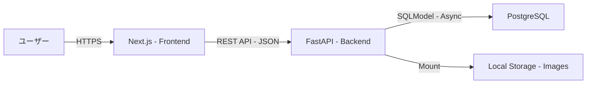
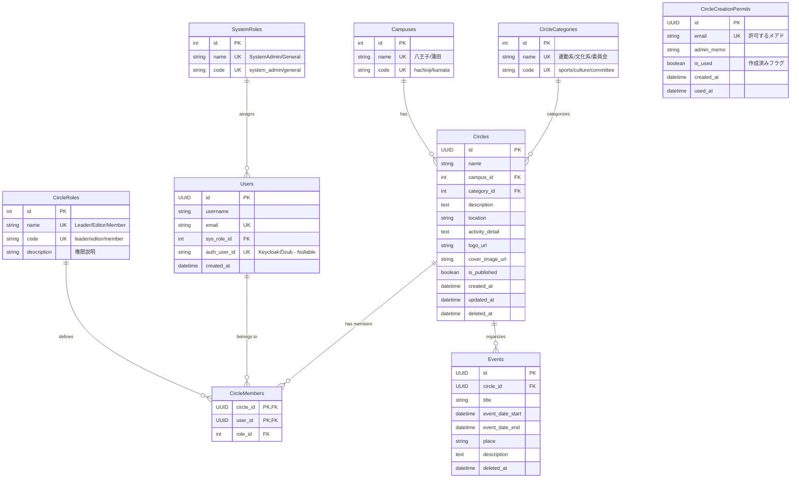
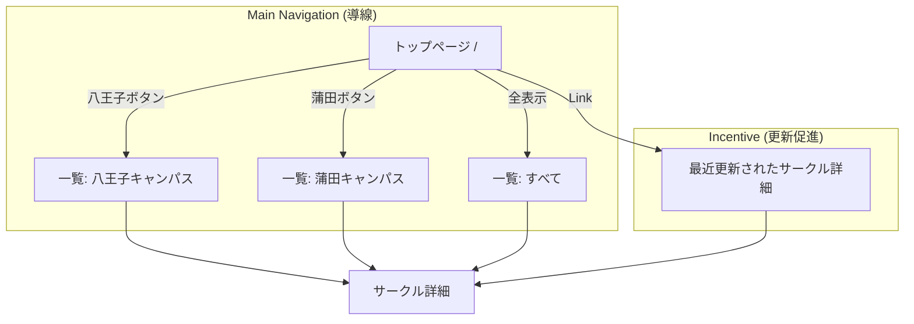

# CirclePortal 要件定義書 & DB設計書

2025-12-05 17:34

## 1. プロジェクト概要

### 1.1. サービス目的

大学のサークル（クラブ・部活・同好会）情報を集約し、学生および学外（受験生等）へ可視化するWebサービス。
情報の鮮度を保つため、**「各サークルの担当者が自律的に情報を更新できる」** ことを最大の強みとする。

### 1.2. ターゲットユーザー

1.  **閲覧者 (Guest):** 受験生、在学生。サークルを探している人。
2.  **サークル管理者 (Circle Admin):** 各サークルの代表・広報担当。情報の更新を行う。
3.  **システム管理者 (System Admin):** 学務課、およびLinuxClub等の運用担当。サークルの承認・停止、全体のお知らせ管理を行う。

-----

## 2. システムアーキテクチャ・技術選定

初心者（学部1\~2年生）でもメンテナンスが可能であり、かつモダンな学習効果の高い構成を採用する。

### 2.1. 技術スタック

| カテゴリ | 技術選定 | 選定理由 |
| :--- | :--- | :--- |
| **Frontend** | **Next.js (App Router)** | 動的なOGP生成、モダンなUI構築のため。表示ロジックに専念する。(バックエンド的な処理・ロジックは組まない) |
| **Backend** | **Python (FastAPI)** | CS学部必修言語(Python)の活用。型安全性とSwagger UIによるAPI定義の明確化。 |
| **Database** | **PostgreSQL** | 堅牢なRDBMS。配列型やJSON型など高度な機能も利用可能。 |
| **ORM** | **SQLModel** | SQLAlchemy + Pydantic。DB定義とAPI型定義を一元管理し、二重管理を防ぐ。 |
| **Infra** | **Docker Compose** | (初期) オンプレサーバでの簡易運用。(将来的にk8sへ移行の可能性有)|
| **UI Lib** | **shadcn/ui + Tailwind** | デザイン担当不在でも、高品質かつ統一感のあるUIを(できるだけ)迅速に構築するため。 |

### 2.2. システム構成図 (概念)



-----

## 3. 機能要件

### 3.1. 認証・認可方針

  * **フェーズ1 (開発初期):** 認証機能はモック、または簡易実装とする。
  * **フェーズ2 (本番運用):** **Keycloak** を導入する。
      * **学内制限:** `@edu.teu.ac.jp` ドメインのみ登録許可（Keycloak側で制御したい）。
          * 管理者アカウントの追加(サービス管理者はedu以外もOK)
      * **権限管理:** ハイブリッド構成を採用。
          * システム管理者権限 $\rightarrow$ KeycloakのRoleで管理。
          * サークル編集権限 $\rightarrow$ アプリDB (`User` - `Circle` 紐付け) で管理。

### 3.2. 主要機能リスト

| 機能 | 概要 | 備考 |
| :--- | :--- | :--- |
| **サークル一覧・検索** | キャンパス別(八王子/蒲田)、カテゴリ別 | フリーワード検索対応 |
| **サークル詳細表示** | 活動内容、活動場所、SNSリンク、新歓情報の表示 | **動的OGP**を生成しSNSシェアに対応 |
| **サークル編集** | サークル管理者が自団体の情報を更新 | 画像アップロード含む |
| **イベント管理** | 新歓、合宿、学祭等のイベント情報登録 | |
| **管理者機能** | サークルアカウントの発行・承認、論理削除されたデータの復旧等 | |

### 3.3. API設計方針

**Strict REST** に基づき設計する。

一部設計: 
| メソッド | エンドポイント | 実行権限 | 概要・挙動 |
| :--- | :--- | :--- | :--- |
| `GET` | **/circles** | **誰でも** | サークル一覧を取得する。<br>※学外ユーザーには公開用フィールドのみ返す。 |
| `POST` | **/circles** | **認証済みユーザー** | 新規サークルを作成する。<br>※**作成したユーザーを自動的に「代表者(Leader)」として登録する。**<br>※初期状態は非公開(`is_published=False`)とする運用を推奨。 |
| `GET` | **/circles/{id}** | **誰でも** | サークル詳細情報を取得する。<br>※学外ユーザーには公開用フィールドのみ返す。 |
| `PUT` | **/circles/{id}** | **代表者・幹部 / 管理者** | サークル情報を更新する。<br>※代表者・幹部は「自分のサークル」のみ操作可能。 |
| `DELETE` | **/circles/{id}** | **代表者 / 管理者** | サークルを削除する(論理削除)。<br>※削除は代表者のみ実行可能。 |

※ `Event` や `User` 関連のエンドポイントも同様のポリシー（更新は権限者のみ）で実装する。

-----

## 4. データベース設計 (Schema)

ORMに **SQLModel** を使用する。以下は論理モデルである。

### 4.1. マスタテーブル

Enumの代わりにマスタテーブルで管理する。データの追加・変更が柔軟に行える。

#### 4.1.1. Campuses (キャンパスマスタ)

  * `id`: Integer (PK, Auto Increment)
  * `name`: String (Unique) - 例: `八王子`, `蒲田`
  * `code`: String (Unique) - 例: `hachioji`, `kamata`

#### 4.1.2. CircleCategories (サークルカテゴリマスタ)

  * `id`: Integer (PK, Auto Increment)
  * `name`: String (Unique) - 例: `運動系`, `文化系`, `委員会`
  * `code`: String (Unique) - 例: `sports`, `culture`, `committee`

#### 4.1.3. SystemRoles (システム権限マスタ)

  * `id`: Integer (PK, Auto Increment)
  * `name`: String (Unique) - 例: `SystemAdmin`, `General`
  * `code`: String (Unique) - 例: `system_admin`, `general`

#### 4.1.4. CircleRoles (サークル内権限マスタ)

  * `id`: Integer (PK, Auto Increment)
  * `name`: String (Unique) - 例: `Leader`, `Editor`, `Member`
  * `code`: String (Unique) - 例: `leader`, `editor`, `member`
  * `description`: String - 権限の説明
      * `Leader`: サークル代表(全権限)
      * `Editor`: 幹部(編集権限あり)
      * `Member`: 平部員(閲覧のみ)

### 4.2. Users (ユーザー)

サークル個別の役割とは別に、システム全体における権限を管理するカラムがある。

  * `id`: UUID (PK)
  * `username`: String
  * `email`: String (Unique)
  * `sys_role_id`: Integer (FK: SystemRoles.id) - システム全体の権限
  * `auth_user_id`: String (Nullable, Unique, Index)
      * フェーズ2用。Keycloak等の外部認証基盤のUser ID (Sub) を格納する。
  * `created_at`: Datetime

### 4.3. Circles (サークル)

  * `id`: UUID (PK)
  * `name`: String
  * `campus_id`: Integer (FK: Campuses.id)
  * `category_id`: Integer (FK: CircleCategories.id)
  * `description`: Text (紹介文)
  * `location`: String (活動場所)
  * **`activity_detail`: Text**
      * 活動日時・頻度等の詳細。
      * 例: `"毎週月曜の17時から活動。たまに水曜も集まります。"`
  * `logo_url`: String
  * `cover_image_url`: String
  * `is_published`: Boolean (公開フラグ)
  * `created_at`: Datetime
  * `updated_at`: Datetime
  * `deleted_at`: Datetime (Nullable, 論理削除)

論理削除であるため、存在するサークル一覧を返す場合 `deleted_at`がnullであることを必ず確認すること

### 4.4. CircleMembers (中間テーブル)

ユーザーとサークルの多対多リレーション。編集権限の管理に使用。
注意として、`circle_id`と`user_id`の組み合わせがユニークになるように制約が必要。

  * `circle_id`: FK (Circles.id, PK)
  * `user_id`: FK (Users.id, PK)
  * `role_id`: Integer (FK: CircleRoles.id)

### 4.5. CircleCreationPermits (作成許可テーブル) [新規]

学務課が事前にメールアドレスを登録しておく「招待状」のようなテーブル。

  * `id`: UUID (PK)
  * `email`: String (Unique)
      * ここに登録されているメールアドレスのユーザーが `POST /circles` できる。
  * `admin_memo`: String (例: "LinuxClub代表 〇〇君")
  * `is_used`: Boolean (Default: `False`)
      * サークル作成完了時に `True` になる。
  * `created_at`: Datetime
  * `used_at`: Datetime (Nullable)

### 4.6. Events (イベント)

  * `id`: UUID (PK)
  * `circle_id`: FK (Circles.id)
  * `title`: String
  * `event_date_start`: Datetime
  * `event_date_end`: Datetime
  * `place`: String
  * `description`: Text
  * `deleted_at`: Datetime
      * 親となるサークル情報の削除にも紐づく

## ER図


-----

## 5. 開発・運用ルール

### 5.1. 画像の保存

  * **初期:** Docker Volume上の特定ディレクトリ（`./static/images/`等）に保存し、Webサーバ(FastAPI or Nginx)で配信する。
  * **将来:** S3互換ストレージ (MinIO等) へ移行。URL生成ロジックは切り出しておくこと。

### 5.2. ディレクトリ構成 (Backend)

SQLModelのメリットを活かしたレイヤードアーキテクチャ。

```text
backend/
├── app/
│   ├── api/            # Router (Endpoints)
│   │   └── v1/
│   │       ├── endpoints/
│   │       │   ├── circles.py
│   │       │   ├── users.py
│   │       │   └── auth.py
│   │       └── api.py
│   ├── core/           # Config (Env vars), Security
│   ├── db/             # DB Session, Init DB
│   ├── models/         # SQLModel Classes (DB & Pydantic)
│   │   ├── user.py
│   │   ├── circle.py
│   │   └── event.py
│   ├── services/       # Business Logic (CRUD functions)
│   └── main.py         # Entrypoint
├── static/             # User uploaded files
├── Dockerfile
└── pyproject.toml
```

### 5.3. データの公開範囲とフィルタリング方針

本方針は、サークル詳細取得エンドポイント (`GET /circles/{id}`) におけるレスポンス制御ルールである。

セキュリティ区分を明確にし、かつフロントエンド側で「データ未登録(Null)」と「権限による非表示(Null)」を区別してUIを出し分けられるよう、以下のルールを徹底する。

#### 共通仕様: 表示モードフラグ (`view_type`)

全てのレスポンスには、現在の閲覧権限レベルを示す `view_type` フィールドを必ず含める。

  * `view_type`: String (Enum)
      * `"public"` : 学外・未ログイン向け（一部情報がマスクされている状態）
      * `"internal"` : 学内・ログイン済み向け（全情報が開示されている状態）

-----

#### 1\. 公開用ビュー (Public View)

  * **対象:** 未ログインユーザー、または学外ユーザー。
  * **挙動:**
      * `view_type` は `"public"` を返す。
      * 機密性の高いフィールド（下記「詳細項目」）は、DBにデータが存在していても強制的に `null` を返す。
  * **取得可能項目:**
      * `id`, `name`, `campus`, `category`, `description`
      * `logo_url`, `cover_image_url`
  * **制限理由:** 活動場所や詳細スケジュールは、不特定多数への公開を避け、学内関係者の安全を保護するため。

#### 2\. 詳細用ビュー (Internal Detail View)

  * **対象:** 学内メールアドレス (`@edu.teu.ac.jp`) で認証済みのユーザー。
  * **挙動:**
      * `view_type` は `"internal"` を返す。
      * 全てのフィールドにおいて、DBに保存されている値をそのまま返す。
          * ※ここで `null` が返ってきた場合、それは「本当にデータが未登録である」ことを意味する。
  * **追加される詳細項目:**
      * `location` (活動場所)
      * `activity_detail` (活動頻度・日時の詳細)
      * `created_at` / `updated_at`
      * `is_published`

-----

#### レスポンスの具体例 (イメージ)

開発者はこのJSONイメージを参考に実装すること。

**ケースA: 学外ユーザーが見た場合 (`view_type: "public"`)**
フロントエンドは `view_type` を見て、「詳細を見るにはログインしてください」等の案内を表示する。

```json
{
  "id": "123e4567-e89b-...",
  "view_type": "public",
  "name": "LinuxClub",
  "description": "Linuxを愛するサークルです。",
  "location": null,         // ★権限がないため null (実際はデータがあるかもしれない)
  "activity_detail": null   // ★権限がないため null
}
```

**ケースB: 学内ユーザーが見た場合 (`view_type: "internal"`)**
フロントエンドは `location` が `null` の場合、「活動場所未定」と表示して良い。

```json
{
  "id": "123e4567-e89b-...",
  "view_type": "internal",
  "name": "LinuxClub",
  "description": "Linuxを愛するサークルです。",
  "location": "A棟 401教室",  // ★データが見える
  "activity_detail": "毎週月曜実施"
}
```

### 5.4. 権限チェックとデータ整合性のルール 

### 5.4.1. サークル新規作成フロー (Permit方式)

「ユーザーのロール」ではなく「許可証テーブル」を確認するフローに変更。

1.  **事前準備 (Admin)**

      * システム管理者は、あらかじめサークルを作らせたい学生のメールアドレスを `CircleCreationPermits` テーブルに登録する。

2.  **APIリクエスト時のチェック (`POST /circles`)**

      * リクエストしたユーザーの `email` を使い、`CircleCreationPermits` テーブルを検索する。
      * **条件:**
        1.  レコードが存在すること。
        2.  `is_used` が `False` であること。
      * 条件を満たさない場合、`403 Forbidden` を返す。

3.  **作成時のトランザクション処理**

      * 条件OKの場合、以下の処理を一括実行する。
        1.  `Circles` レコード作成。
        2.  `CircleMembers` レコード作成 (`role=Leader`)。
        3.  **`CircleCreationPermits` の `is_used` を `True` に更新し、`used_at` に現在時刻を入れる。**


## 6\. フロントエンド設計 (Frontend Design) [Rev.2]

Next.js (App Router) を採用し、**Server Components** を主体とした設計を行う。
UIライブラリには **shadcn/ui** を採用し、デザイン・実装コストを最小化する。

### 6.1. ディレクトリ構成

Next.js App Router の標準構成に準拠する。
トップページ (`app/page.tsx`) と検索一覧ページ (`app/circles/page.tsx`) の役割を明確に分ける。

```text
frontend/
├── src/
│   ├── app/                 # App Router
│   │   ├── layout.tsx       # 全体レイアウト (Header/Footer)
│   │   ├── page.tsx         # トップページ (導線 & 更新インセンティブ)
│   │   ├── circles/         # サークル一覧・検索機能 (メイン機能)
│   │   │   ├── page.tsx     # 検索・フィルタリング・一覧表示
│   │   │   ├── [id]/        # 詳細画面
│   │   │   │   ├── page.tsx
│   │   │   │   └── opengraph-image.tsx # 動的OGP
│   │   │   └── create/      # 新規作成 (要権限)
│   │   └── admin/           # システム管理画面
│   ├── components/
│   │   ├── ui/              # shadcn/ui (Button, Card等)
│   │   ├── features/        # 機能単位
│   │   │   ├── CircleCard.tsx   # サークル表示カード (共通)
│   │   │   ├── SearchFilter.tsx # 検索サイドバー/モーダル
│   │   │   └── RecentUpdates.tsx # 最近更新されたサークルリスト
│   │   └── layouts/         # Header, Footer
│   ├── lib/
│   │   ├── api.ts           # Backend Fetch Wrapper
│   │   └── utils.ts
│   └── types/               # Schema Types
├── public/
└── tailwind.config.ts
```

### 6.2. ページ構成と役割

#### 6.2.1. トップページ (`/`)

**目的:** ユーザーを即座に「目的の一覧」へ誘導すること、およびサークル側に更新を促すこと。

  * **Primary Action (導線):**
      * **「八王子キャンパスのサークルを見る」** ボタン (To: `/circles?campus=hachioji`)
      * **「蒲田キャンパスのサークルを見る」** ボタン (To: `/circles?campus=kamata`)
      * 画面中央に大きく配置し、迷わせない。
  * **Secondary Content (インセンティブ):**
      * **「最近更新されたサークル」** セクション。
      * `updated_at` が新しい順に4〜8件のカードを表示する。
      * 意図: 「更新すればトップページに載る」というモチベーションをサークル管理者に与え、情報の鮮度を維持する。

#### 6.2.2. 一覧・検索ページ (`/circles`)

**目的:** ユーザーが条件を絞り込んでサークルを見つけること。

  * **機能:**
      * フリーワード検索
      * カテゴリ・キャンパスでの絞り込み
      * 活動曜日での絞り込み（テキスト検索ベース）
  * **実装:** URLクエリパラメータ (`?q=...&category=...`) で状態を管理し、共有可能にする。

### 6.3. 実装方針・ルール

#### 6.3.1. Server Components vs Client Components

  * **Server Components (Default):**
      * データ取得（`fetch`）は全てここで行う。
      * トップページの「最近更新されたリスト」もサーバーサイドでレンダリングする。
  * **Client Components (`"use client"`):**
      * インタラクティブな要素のみに使用する（検索フォームの入力ハンドリング、ハンバーガーメニュー等）。

#### 6.3.2. データフェッチ

  * **Read (GET):** Server Component 内で `fetch(API_URL, { cache: 'no-store' })` 等を使用し、常に最新（あるいは適切にキャッシュされた）データを取得する。
  * **Write (POST/PUT/DELETE):** Client Component からバックエンドAPIを呼び出す。

#### 6.3.3. 表示制御 (`view_type` のハンドリング)

  * バックエンドからのレスポンスに含まれる `view_type` (`public` / `internal`) に基づき、詳細情報の表示・非表示（「ログインして詳細を見る」等のマスク処理）を制御する。

### 6.4. デザインシステム (shadcn/ui)

  * **コンポーネント:** `src/components/ui` 配下のコンポーネントを使用。
  * **アイコン:** **Lucide React** を使用。
  * **スタイリング:** **Tailwind CSS** を使用。

### 6.5. 画面遷移図 (Site Map)

トップページからの導線を最優先した設計とする。



-----

## 7\. 開発環境・ワークフロー (Development Environment & Workflow)

開発チーム全員が統一された環境で効率的に作業を進めるためのツールセットとルールを定義する。

### 7.1. 必須ツールセット (Toolchain)

環境差異によるバグを防ぐため、以下のツール導入を必須とする。

| カテゴリ | ツール | 用途・運用ルール |
| :--- | :--- | :--- |
| **環境管理** | **mise** | 言語バージョン管理 (`node`, `python`) およびタスクランナーとして使用。<br>`mise.toml` にバージョンを固定し、全員が同じ環境を再現できるようにする。 |
| **Python管理** | **uv** | 高速なパッケージ管理・仮想環境作成に使用。<br>`pip` や `poetry` の代わりに使用する (`uv sync` 等)。 |
| **Node管理** | **npm** | フロントエンドのパッケージ管理。Node本体は `mise` で管理する。 |
| **Container** | **Docker** | DB (PostgreSQL) や S3 (MinIO) などのミドルウェア起動に使用。<br>Compose V2 (`docker compose`) を前提とする。 |
| **VCS** | **Git / GitHub** | バージョン管理。 |
| **Testing** | **pytest / Vitest** | BEは `pytest`、FEは `Vitest` を使用する。 |

### 7.2. エディタ・AI支援

  * **Editor:** **VS Code** (Visual Studio Code) を推奨。
      * **推奨拡張機能:**
          * Python (Microsoft)
          * Pylance
          * ES7+ React/Redux/React-Native snippets
          * Tailwind CSS IntelliSense
          * Pretty TypeScript Errors
  * **AI Pair Programmer:** **GitHub Copilot**
      * ボイラープレートコード（定型文）の生成や、テストコードの作成に積極活用する。
      * **注意:** 生成されたコードは必ず人間が内容を理解し、セキュリティやロジックに問題がないか確認してからコミットすること。

### 7.3. バージョン管理フロー (GitHub Flow)

シンプルで迅速な開発サイクルを回すため、**GitHub Flow** を採用する。

1.  **Main Branch:** 常にデプロイ可能な状態を保つ。直接コミットは禁止。
2.  **Feature Branch:** `main` から分岐して作業する。
      * 命名規則: `feature/機能名` (例: `feature/add-login`, `fix/typo-circle-list`)
3.  **Pull Request (PR):** 作業が完了したら `main` へ向けてPRを作成する。
      * PR作成時、自動テストやLintチェック（CI）が通ることを確認する。
      * 原則として、開発者自身以外の**1名以上のReview**を通してからマージする。
4.  **Merge:** マージ後はブランチを削除する。

### 7.4. コミットメッセージ規約

後から履歴を追いやすくするため、**Conventional Commits** に準じたプレフィックスを付けることを推奨する。

  * `feat:` 新機能 (feature)
  * `fix:` バグ修正 (bug fix)
  * `docs:` ドキュメントのみの変更
  * `style:` コードの動作に影響しない変更（空白、フォーマット等）
  * `refactor:` リファクタリング（機能追加もバグ修正も含まないコード変更）
  * `test:` テストコードの追加・修正
  * `chore:` その他、ビルドプロセスやツールの変更など

### 7.5. 便利コマンド (mise tasks)

開発効率化のため、`mise.toml` に以下のタスクを定義しておく（例）。

  * `mise run dev`: Docker(DB)を起動し、BackendとFrontendの開発サーバーを同時に立ち上げる。
  * `mise run test`: BackendとFrontendのテストを一括実行する。
  * `mise run setup`: 依存ライブラリのインストール (`uv sync`, `npm install`) を一括で行う。

### 7.6. テスト戦略とTDD (Test-Driven Development) (推奨)

品質担保とリファクタリングの心理的安全性確保のため、**テスト駆動開発(TDD)** の考え方を取り入れる。

#### 7.6.1. バックエンド (FastAPI + pytest)

**APIの挙動を保証するため、エンドポイント単位のテスト実装を必須とする。**

  * **ツール:** `pytest`, `httpx` (AsyncClient)
  * **方針:**
    1.  **Red (失敗):** 実装前に、「期待するレスポンス（正常系・異常系）」を定義したテストコードを書く。
          * 例: 「一般ユーザーがサークル削除APIを叩いたら 403 Forbidden が返ること」を確認するテスト。
    2.  **Green (成功):** テストが通るようにAPIを実装する。
    3.  **Refactor:** コードを綺麗にする。
  * **対象:** APIエンドポイント (`api/v1/endpoints/`)、複雑なビジネスロジック (`services/`)。

#### 7.6.2. フロントエンド (Next.js + Vitest)

**ロジックの正しさを保証するため、ユーティリティ関数等のユニットテストを推奨する。**

  * **ツール:** `Vitest` (Jestよりも高速で設定が楽なため採用)
  * **方針:**
      * UIコンポーネントの見た目のテストはコストが高いため必須としない。
      * `lib/utils.ts` 内の関数や、複雑なフックのロジックはテスト対象とする。
